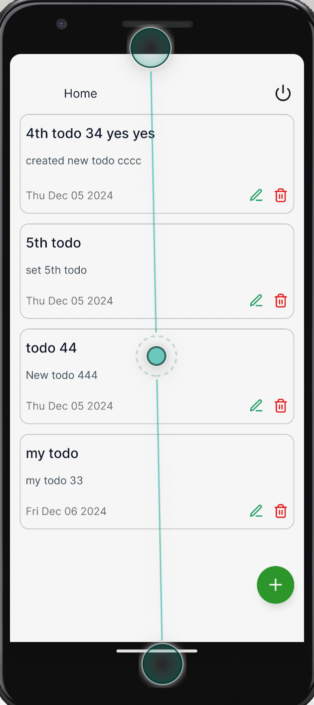
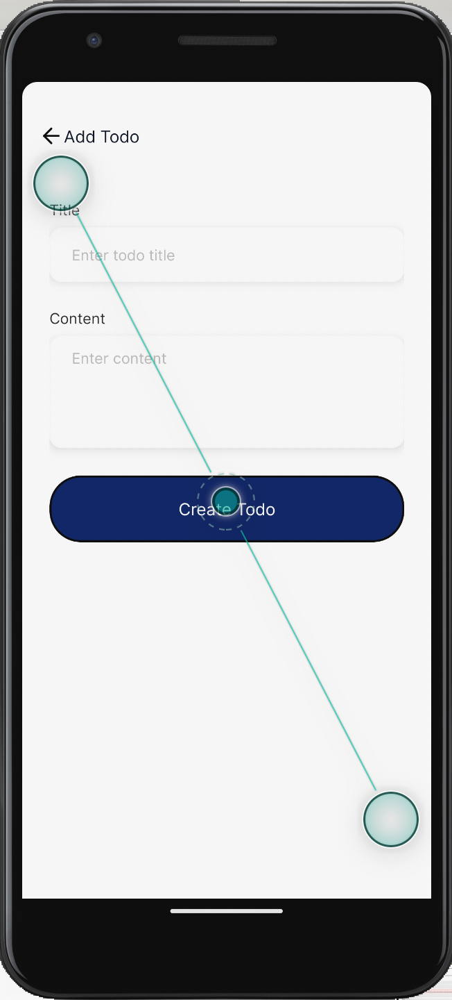
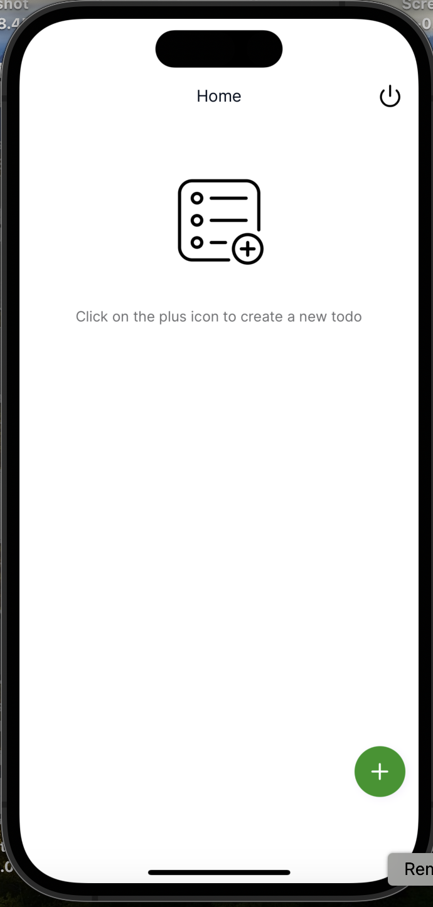
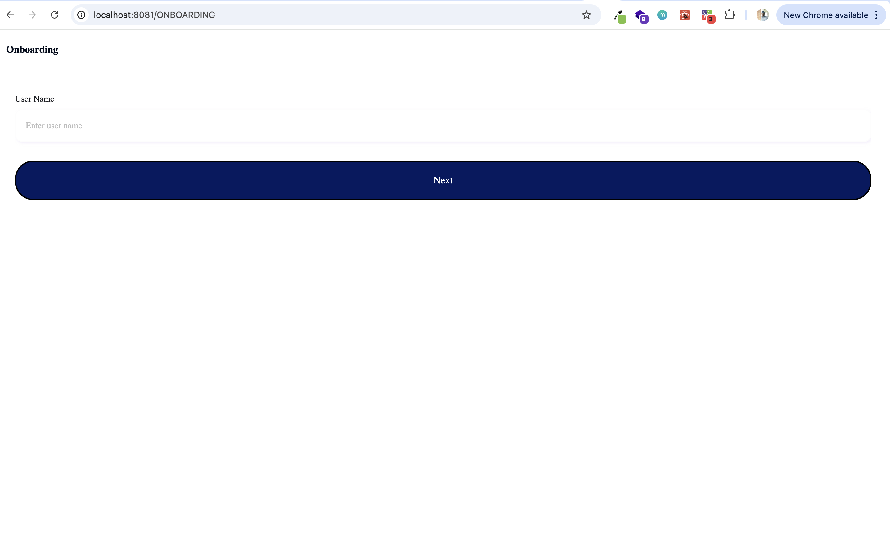

# Welcome to The Go Game app 👋

This is an [Expo](https://expo.dev) project created with [`create-expo-app`](https://www.npmjs.com/package/create-expo-app).

## Get started

1. Install dependencies

   ```bash
   yarn install
   ```

2. Start the app

   ```bash
    yarn start
   ```

3. To run test

   ```bash
    yarn jest
   ```

## Get started

The app run on Web, IOS and Android

## Screenshots





